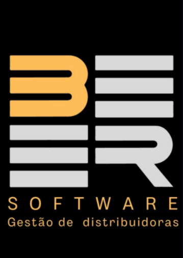
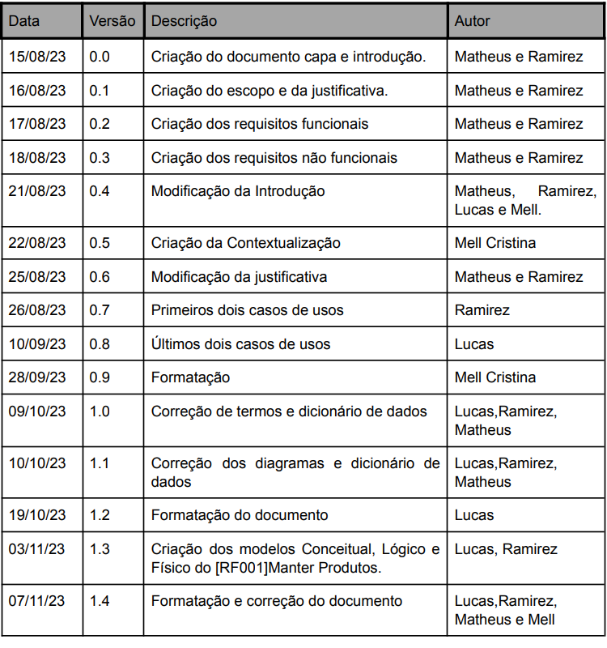
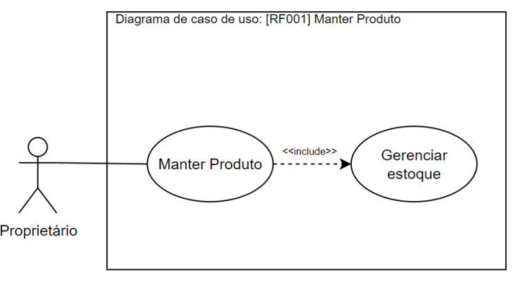
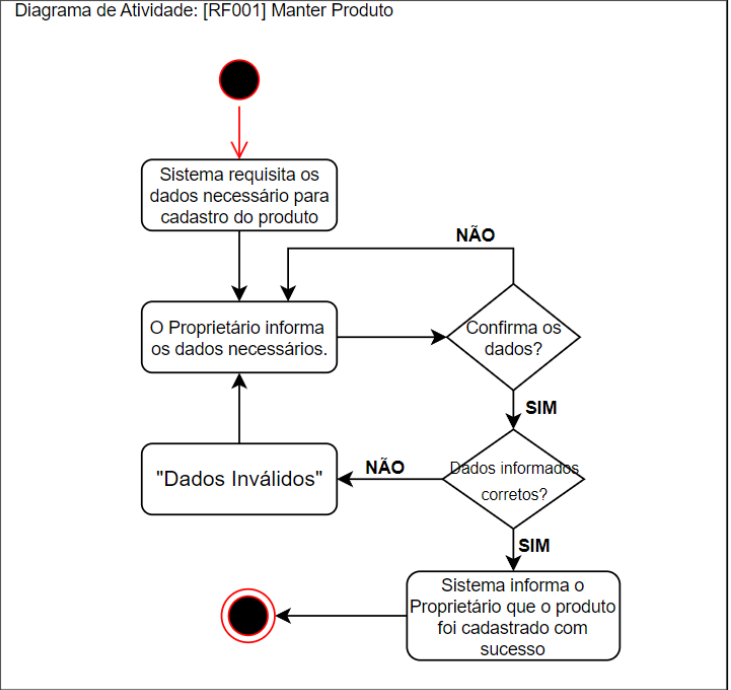
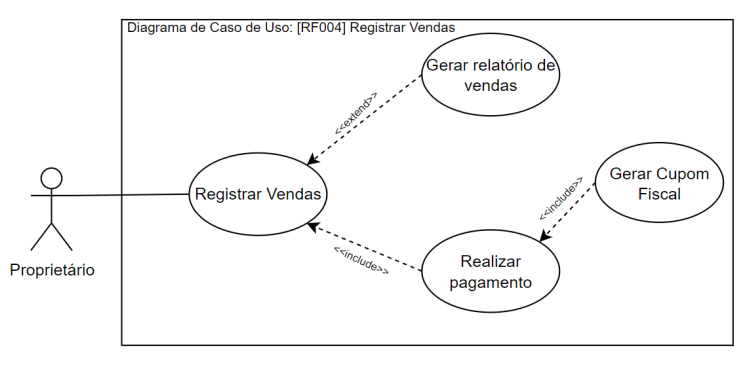
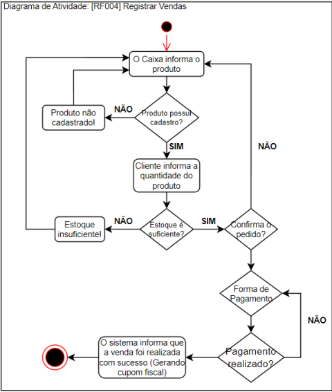
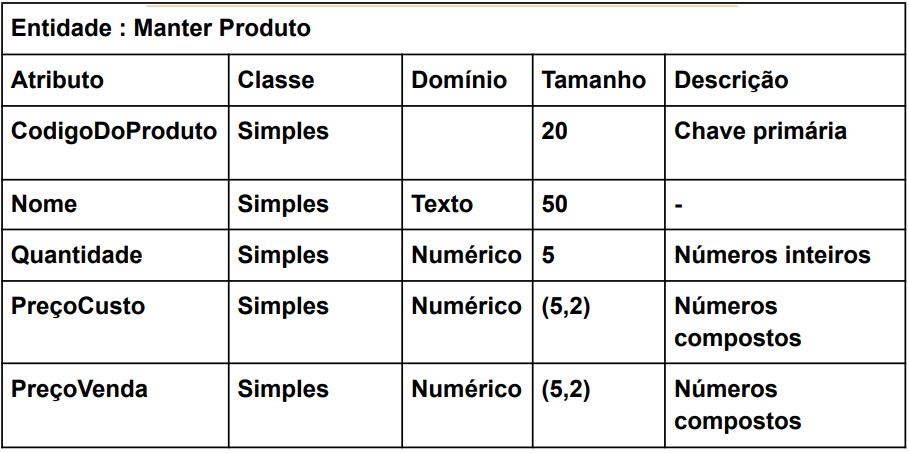
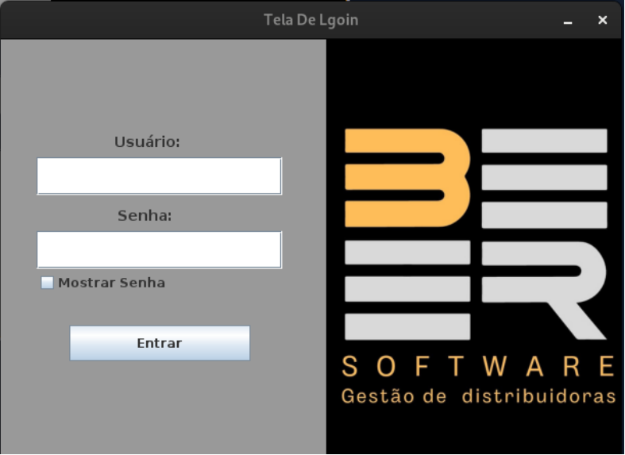
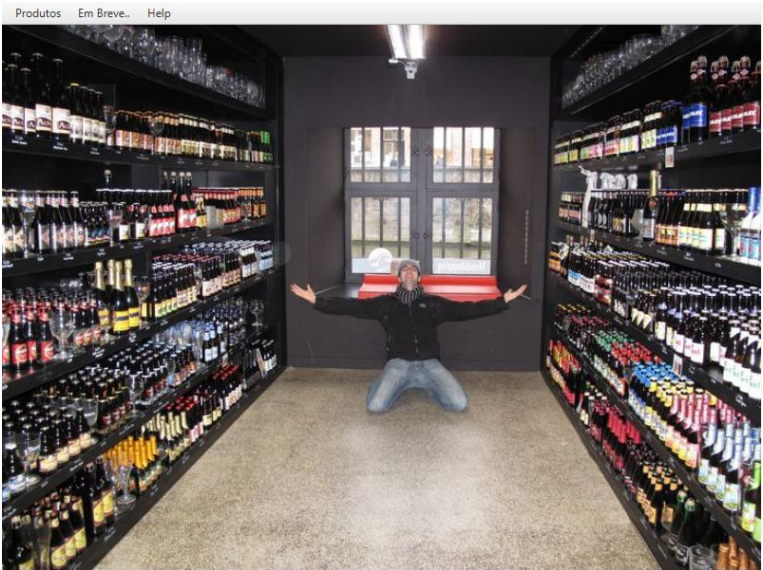
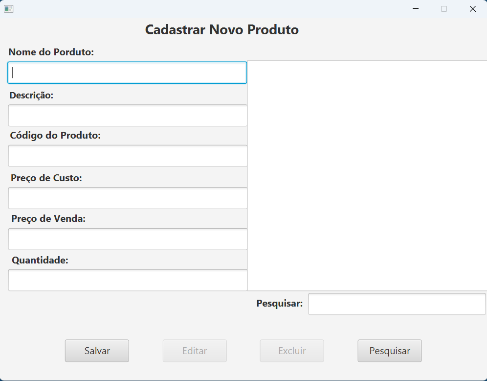

# FACULDADE SENAC GOIÁS

 

## ANÁLISE E DESENVOLVIMENTO DE SISTEMAS 

   

  

**Projeto Integrador
Documento de Requisitos do sistema
pdv para Distribuidora de bebidas**
   

**Goiânia 2024**

**Ramirez Marques De Andrade Campello**
   

**Projeto Integrador Documento de Requisitos do Sistema**
 
**Projeto Integrador apresentado ao curso de Análise e Desenvolvimento de Sistemas da Faculdade Senac Goiás como requisito parcial para conclusão da disciplina Projeto Integrador II: Análise e Lógica de Programação Aplicada.**

**Orientador (a): Prof. Roussian Gaioso**
   

#### Histórico de Alterações

  

## Sumário

_________________________

**INTRODUÇÃO** -------------------------------------------------------[5]

**1.0 Finalidade do Documento de Requisitos**----------------------[5]

**1.1 Contextualização**-------------------------------------------------[5]

**1.2 Escopo do Produto**-----------------------------------------------[6]

**1.3 Justificativa**--------------------------------------------------------[6]

**1.4 Identificação Dos Requisitos**-------------------------------------[7]

**1.4.1 Legendas**---------------------------------------------------------[7]

**1.4.2 Prioridade dos Requisitos**--------------------------------------[7]

**2 Requisitos Funcionais [RF]**------------------------------------------[8]

**2.1 [RF001]Manter Produtos**------------------------------------------[8]

**2.2 [RF002]Controlar Estoque**-----------------------------------------[9]

**2.3 [RF003]Registrar Vendas**-------------------------------------------[9]

**2.4 [RF004]Configurar Operações de Pagamentos**------------------[9]

**2.5 [RF005]Gerar Cupom Fiscal**----------------------------------------[9]

**2.6 [RF006]Controlar Acesso de Usuários**----------------------------[10]

**3 Requisitos Não-Funcionais [RNF]**------------------------------------[10]

**3.1 [RNF001]Desempenho**----------------------------------------------[10]

**3.2 [RNF002]Confiabilidade**--------------------------------------------[10]

**3.3 [RNF003]Disponibilidade**----- -------------------------------------[11]

**3.4 [RNF004]Interface Intuitiva**----------------------------------------[11]

**3.5 [RNF005]Escalabilidade**---------------------------------------------[11]

**3.1 [RNF001]Compatibilidade**------------------------------------------[11]

**4 Especificação de Requisitos**---------------------------------------[11-20]

**5 Dicionário de Dados**---------------------------------------------------[21]

**6 Prototipação**---------------------------------------------------------[21-24]

**7 Modelo de Banco de dados (Estoque)**----------------------------[25-26]

### INTRODUÇÃO

#### 1.0 Finalidade do documento de requisitos

O documento de requisitos é uma comunicação formal destinada ao cliente e a
todos envolvidos na produção dessa solução, a terem uma visão clara do que será
entregue ao cliente, o que ajuda a garantir que as expectativas do cliente sejam
atendidas.
O documento de requisitos serve como uma referência para o controle de
mudanças no projeto, descreve detalhadamente os requisitos funcionais e não
funcionais para esta solução, incluindo os fluxos de trabalho, as interfaces e as
restrições. Isso permite que a equipe de desenvolvimento tenha uma
compreensão clara do que precisa ser implementado, testado e entregue.

#### 1.1 Contextualização

Ordeiramente ao ter contato com pequenas empresas de bebidas, notou-se
que os clientes foram recebidos por apenas um vendedor. Enquanto a
movimentação contínua era gerada, observamos as dificuldades enfrentadas pelo
atendente na gestão dos pedidos, tendo como vista o mesmo somando todos os
valores em uma pequena calculadora, que por algumas vezes havia a
necessidade de conferência dos valores a serem cobrados do pedido do cliente.
Ao notarmos também a constante ocasiões em que o mesmo deveria sair de seu
lugar para verificar os produtos em estoque, deixando o cliente em dúvida e na
espera da possibilidade de haver ou não o produto desejado.
Conforme nessas análises percebemos que nesse caso havia uma
oportunidade para se desenvolver um software PDV (Ponto De Venda) podendo
ajudar a transformar os negócios das microempresas em um exemplo de eficiência
e sucesso, facilitando a conduta do vendedor e consequentemente melhorando as
vendas e os lucros dos micros distribuidoras de bebidas. Tendo como base o
perfeito controle das disponibilidades, utilidades e variedades perante aos clientes.
Visando o controle de microempresas que fornecem o produto instantaneamente
para o cliente, tendo o controle de mercadoria rápida.

#### 1.2 Escopo do produto

O projeto consiste na criação de uma solução para gestão de vendas
personalizada para distribuidoras de bebidas de pequeno e médio porte que
trabalham com vendas onde o cliente compra o produto e não possui local para
consumo. A solução será desenvolvida para otimizar as operações da
distribuidora, incluindo aspectos como controle de estoque, gerenciamento de
vendas e registro de produtos.
Propomos facilitar o registro e a categorização de produtos disponíveis na
distribuidora, gerenciar de forma eficiente o estoque de produtos, automatizar e
simplificar o processo de registro de vendas, incluindo cálculos automáticos de
preços, oferecer um painel para o controle financeiro, apresentando dados sobre
vendas, faturamento e lucratividade, possibilitando a geração de relatórios e
análises para embasar decisões estratégicas.
Atender à necessidade do nicho de distribuidoras de bebidas através de
uma ferramenta que crie um método mais eficiente e veloz faz com que a
competitividade seja o que diferencia dos demais do mesmo segmento, a
introdução de uma solução inteligente e criativa que proporciona melhor gestão de
todas as atividades gerando assim maiores lucros.

#### 1.3 Justificativa

A justificativa para a criação deste projeto surgiu a partir da percepção de
que poucos comerciantes do ramo de distribuidoras de bebidas utilizam-se de
sistemas ou ferramentas que auxiliem na automação dos processos. Notou-se que
a maioria das empresas desse nicho ainda opera de maneira onde não existe
nenhuma ferramenta de controle de estoque ou de gerenciamento de vendas.
Esse cenário apresenta uma oportunidade única de introduzir tecnologia
que pode não apenas modernizar o setor, mas também proporcionar o aumento
substancial de lucratividade.
Ao criar um sistema personalizado que atenda às necessidades específicas
do setor de distribuição de bebidas, pretendemos transformar esses desafios em
oportunidades.
Além disso, o mercado está cada vez mais receptivo a soluções
tecnológicas que simplificam processos e melhoram a experiência do cliente. Ao
implementar uma solução de gestão, não apenas otimizamos as operações
internas, mas também uma melhora na eficiência do atendimento ao cliente.

#### 1.4 Identificação dos Requisitos

Cada requisito será unicamente identificado no formato [tipo Requisito.
Número]. Para requisitos funcionais, o código do tipo de requisito será RF, e para
requisitos não funcionais, RNF. Um número será assinalado a cada requisito de
forma incremental, na ordem que forem mencionados neste documento.

#### 1.4.1 Legendas

#### RNF- Requisitos Não Funcionais

#### 1.4.2 Prioridades dos Requisitos

Foram adotadas as seguintes denominações para estabelecer a prioridade dos
requisitos: essencial, importante e desejável.

● Essencial: é o requisito sem o qual o sistema não entra em funcionamento, ou
seja, são requisitos imprescindíveis tendo que ser implementados
impreterivelmente.

● Importante: é o requisito sem o qual o sistema entra em funcionamento, mas
de maneira insatisfatória, ou seja, devem ser implementados, mas se não
forem, o sistema poderá ser implantado e usado mesmo assim.

● Desejável: é o requisito que não compromete as funcionalidades básicas do
sistema, podendo funcionar de forma satisfatória sem ele, ou seja, são
requisitos que podem ser deixados para versões posteriores do sistema, caso
não haja tempo hábil para implementá-los na versão que está sendo
especificada.

#### 2 - Requisitos Funcionais [RF]

#### 2.1 [RF001] Manter Produtos
Prioridade: ☒ Essencial ☐ Importante ☐ Desejável

O sistema deve permitir o cadastro, edição, exclusão e pesquisa de
produtos disponíveis na distribuidora de bebidas. Isso inclui informações
essenciais, como nome, descrição, preço de venda e preço de compra.

#### 2.2 [RF002] Controlar de Estoque
Prioridade: ☐ Essencial ☒ Importante ☐ Desejável

O sistema deve atualizar a quantidade de produtos sempre que houver uma
venda ou entrada de novos produtos no estoque, além de alertar sobre níveis
baixos de estoque com quantidade inferior a 15 unidades.

#### 2.3 [RF003] Registrar Vendas
Prioridade: ☒ Essencial ☐ Importante ☐ Desejável

O sistema deve proporcionar registro de vendas, permitindo ao funcionário
ou dono registrar produtos escolhidos pelo cliente, com a possibilidade de alterar
quantidades, excluir itens e cancelar a compra.
Após a escolha do cliente dos produtos a serem levados, o sistema deve gerar um
resumo claro dos produtos selecionados, quantidades, preços individuais e valor
total a ser pago.

#### 2.4 [RF004] Configurar Operações de Pagamentos
Prioridade: ☒ Essencial ☐ Importante ☐ Desejável

O sistema deve ser capaz de integrar-se com o RF003 de vendas,
permitindo o registro de formas de pagamentos e a finalização da transação. Além
disso, deve oferecer suporte a diversas formas de pagamentos tais como: cartões
de créditos, cartões de débito, pix e ou dinheiro em cédulas.

#### 2.5 [RF005] Gerar Cupom Fiscal
Prioridade: ☒ Essencial ☐ Importante ☐ Desejável

O sistema deve permitir um fluxo contínuo entre o registro de vendas e a
geração de cupons fiscais, ao finalizar uma venda e escolher a forma de
pagamento, o sistema deve automaticamente criar e disponibilizar um cupom fiscal
finalizando então uma venda e retornando para a tela de registro de vendas.

#### 2.6 [RF06] Controlar Acesso de Usuários
Prioridade: ☐ Essencial ☐ Importante ☒ Desejável

O sistema deve oferecer recursos de controle de acesso para garantir que
apenas usuários autorizados possam realizar determinadas ações e acessar o
sistema.
Deve ser possível cadastrar diferentes tipos de usuários, como
administradores e operadores de caixa, o sistema deve registrar e manter um
histórico de atividades dos usuários, como login, alterações de produtos e vendas
realizadas.

#### 3 - Requisitos Não-Funcionais [RNF]
Os requisitos que descrevem os aspectos não-funcionais do sistema são
apresentados a seguir:

#### 3.1 [RNF001] Desempenho

O sistema deve ser capaz de processar transações de vendas e
atualizações de estoque em menos de 3 segundos, mesmo em momentos de pico
de demanda.

#### 3.2 [RNF002] Confiabilidade

O sistema deve ser confiável, minimizando a possibilidade de falhas ou
interrupções durante o processo de vendas e gestão de estoque.

#### 3.3 [RNF003] Disponibilidade

O sistema deve estar disponível para uso contínuo, 24 horas por dia, 7 dias
por semana, garantindo que as operações da distribuidora não sejam
prejudicadas.

#### 3.4 [RNF004] Interface Intuitiva

A interface do sistema deve ser intuitiva e de fácil uso, com pelo menos 3
horas de treinamento para os usuários.

#### 3.5 [RNF005] Escalabilidade

O sistema deve ser feito para lidar com o crescimento da distribuidora,
suportando um aumento no volume de vendas e no número de produtos e pronto para poder integrar com ex: (nuvem, ifood etc..).

#### 3.6 [RNF006] Compatibilidade

O sistema deve ser compatível com diferentes sistemas operacionais.

#### 4 Especificação de Requisitos

#### [RF001] Manter Produtos

**Escopo**

● Sistema de PDV e tem como objetivo permitir o cadastro, edição ou
exclusão de produtos no Sistema.
Nível

● Objetivo do usuário

**Atores**

● Proprietário / Caixa.

**Interessados e Interesses (Historia do Usuário)**

● Como proprietário desejo ter acesso total sobre o estoque, bem como
cadastrar, editar e excluir produtos.

● Como caixa desejo ter acesso ao estoque atualizado para facilitar as
vendas.

**Pré-Condições**

● O Proprietário deve estar logado no Sistema ou o Caixa para poder
realizar alguma operação.

**Garantia de Sucesso**

● Os produtos são adicionados, editados ou excluídos corretamente no
sistema para o PDV, realizando as alterações no controle de estoque, se
necessário.

**Cenário de Sucesso Principal (ou Fluxo Básico)**

1. O proprietário seleciona a opção "Produtos" no sistema de PDV.
2. O proprietário escolhe uma das opções disponíveis: adicionar novo produto,
editar produto existente ou excluir produto.
3. Se o Proprietário escolher adicionar novo produto:

a. O sistema apresenta um formulário vazio para preenchimento dos dados do novo produto.

b. O proprietário preenche as informações sobre o produto tais como:
código de barras, data de validade ou se for o caso de salgados ou
qualquer produto produzido ou vendido no local o sistema cria um código para cada produto conforme vai sendo adicionado.

c. O proprietário confirma a adição do novo produto.

d. O sistema valida os dados inseridos e registra o novo produto na lista de produtos no sistema.

4. Se o proprietário escolher editar produto existente:

a. O proprietário seleciona a ferramenta de busca na lista de produtos
cadastrados.

b. O proprietário selecione o produto que deseja editar.

c. O sistema exibe um formulário preenchido com os dados atuais do
produto.

d. O proprietário realiza as alterações necessárias nos campos desejados.

e. O proprietário confirma as alterações realizadas.

f. O sistema valida os dados atualizados e atualiza as informações do
produto no banco de dados.

5. Se o proprietário escolher excluir o produto:

a. O sistema exibe a lista de produtos cadastrados.

b. O Proprietário através de ferramenta de busca seleciona o produto que deseja excluir.

c. O sistema solicita a confirmação do proprietário para excluir o produto selecionado.

d. O proprietário confirma a exclusão do produto.

e. O sistema remove o produto da lista do sistema.

**Extensões (Fluxo Alternativo)**

1. Se ocorrer uma falha na conexão com a internet durante qualquer
operação:

a. O sistema exibe uma mensagem de erro informando a falha.

b. O Administrador é orientado a tentar novamente mais tarde.

c. O caso de uso é interrompido.

2. Se o usuário tentar adicionar qualquer valor negativo:

a. O sistema exibe uma mensagem de erro informando:“Valor invalido”.

b. O sistema retorna para a tela de cadastro de produto, a fim do
usuário possa adicionar um valor válido ou cancelar a operação.

c. O caso de uso é interrompido.

3. Se o usuário tentar adicionar um produto já cadastrado:

a. O sistema exibe uma mensagem: “Produto já cadastrado”.

b. O sistema retorna para a tela de cadastro de produtos, porém com
apenas a opção de edição ou cancelar a operação.

c. O caso de uso é interrompido.

**Frequência de Ocorrência**

Deve ser contínua.

**Problemas em Aberto**

1. Sincronização de estoque: Garantir a sincronização adequada entre as alterações feitas na lista de produtos e o controle de estoque em tempo real.

2. Segurança e proteção de dados: Garantir a segurança dos dados sensíveis do sistema de PDV, como informações de pagamento e dados do cliente.

3. Desempenho e escalabilidade: Lidar com o aumento do volume de
cadastros e garantir que o sistema de PDV seja capaz de lidar com maior quantidade de cadastros.

#### Diagrama de Caso de Uso: [RF001] Manter Produtos
----------------------
 

 

#### Diagrama de Atividade: [RF001] Manter Produtos
_____________________

 

 

#### 4.1 Especificação de Requisitos

#### [RF004] Registrar Vendas

**Escopo**

● Sistema de PDV e tem como objetivo registrar e acompanhar as vendas
realizadas pelo sistema.

**Atores**

● Proprietário / Caixa.

**Interessados e Interesses (Historia do Usuário)**

● Como proprietário desejo ter acesso total sobre o gerenciamento de
vendas, incluindo informações sobre faturamento, margem de lucro, vendas por período sobre as vendas realizadas para fins de análise e tomada de decisão.

● Como Caixa desejo registrar as vendas com rapidez e precisão,
garantindo a correta atribuição dos itens vendidos e das formas de pagamentos utilizadas.

● A Secretaria da Fazenda necessita que todas as vendas sejam
devidamente registradas via sistema com cupons fiscais.

**Pré-Condições**

● O proprietário deve estar identificado e autenticado no sistema ou o
funcionário.

**Garantia de Sucesso**

● As vendas são registradas corretamente no sistema de PDV, com
informações precisas sobre os itens vendidos, formas de pagamentos utilizadas eos valores totais.

**Cenário de Sucesso Principal (ou Fluxo Básico)**

1. O caixa seleciona a opção "Controlar Vendas" no sistema de PDV.

2. O sistema exibe a tela de registro de vendas.

3. O caixa registra os produtos na leitora de código de barras.

4. O sistema atualiza o valor parcial da venda automaticamente com base nos itens selecionados.

5. O caixa seleciona a forma de pagamento utilizado pelo cliente (dinheiro, cartão de crédito, débito, etc.).

6. O sistema registra o meio de pagamento e atualiza o valor total da venda, considerando eventuais descontos ou taxas.

7. O caixa concluiu o registro da venda.

8. O sistema armazena as informações da venda, incluindo os itens vendidos, o valor total, o meio de pagamento e a data/hora da transação.

9. O sistema exibe uma confirmação de que a venda foi registrada com
sucesso.

10.O sistema imprime cupom fiscal.

11. O caixa pode repetir o processo para registrar novas vendas.

**Extensões (ou Fluxo Alternativo)**

1. Se o caixa selecionar um produto duas vezes ou o cliente resolver trocar de produto:

a. O usuário abre a opção de remover da lista.

b.O fluxo retorna ao passo correspondente para que o usuário ajuste a quantidade ou exclua um produto.

2. Se o caixa enfrentar algum problema com o meio de pagamento escolhido:

a. O sistema fornece uma mensagem de erro indicando a falha.

b. O fluxo retorna ao passo correspondente para que o caixa escolha um meio de pagamento válido.

3. Se o cliente quiser cancelar a compra:

a. O usuário abre a opção de cancelar a venda.

b. O sistema informa uma mensagem “Deseja cancelar a venda? (Sim/Não)”.

c. Se “Não” volta à tela de venda para finalizar a venda.

d. Se “Sim” o sistema cancela a compra e abre uma nova tela de vendas.

**Frequência de Ocorrência**

Deve ser contínua.

**Problemas em Aberto**

1. Possíveis falhas na integração com sistemas de pagamento, causando
interrupções no registro das vendas.

2. Necessidade de garantir que os dados de vendas sejam armazenados e
transmitidos de forma segura para proteger informações sensíveis dos
clientes.

3. Questões de desempenho quando lidar com um grande volume de vendas,
garantindo uma resposta rápida e eficiente do sistema.

#### Diagrama de caso de uso: [RF004] Registrar Vendas
-------------
 

 

#### Diagrama de Atividades: [RF004] Registrar Vendas
------
 

 

#### 5 Dicionário de Dados
---------------
 

 

#### 6 Prototipação
-------

#### Tela de Login
-----
 

 

#### Tela Inicial
-------
 

 

#### Cadastrar Produto
----
 

# Obrigado a Todos!
##### Ramirez Marques De Andrade Campello.

